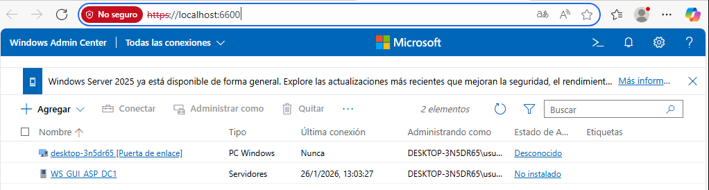
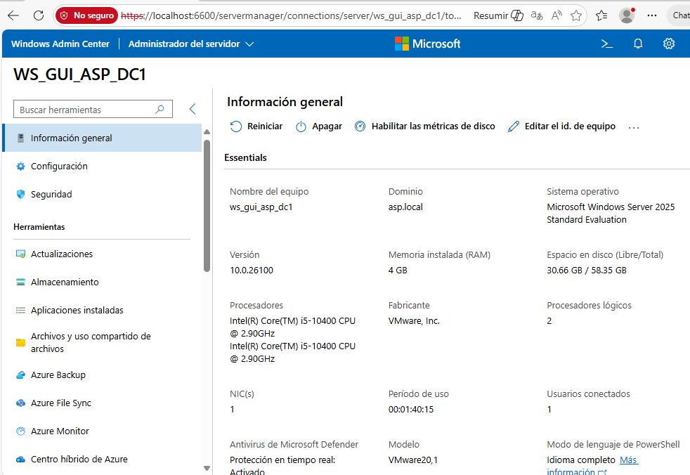
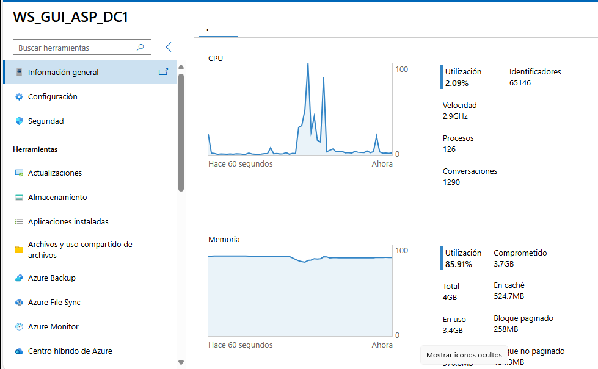
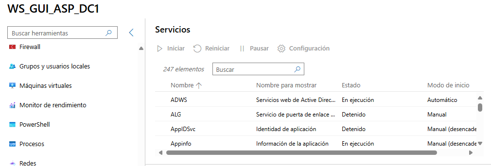
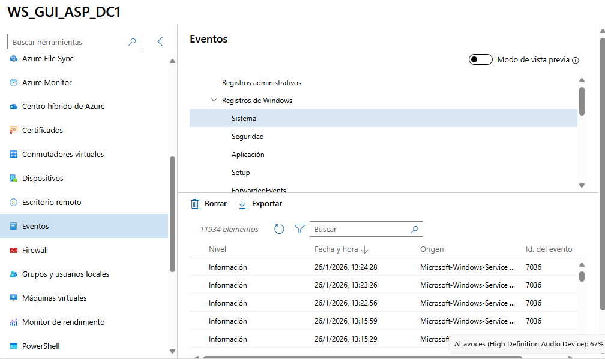
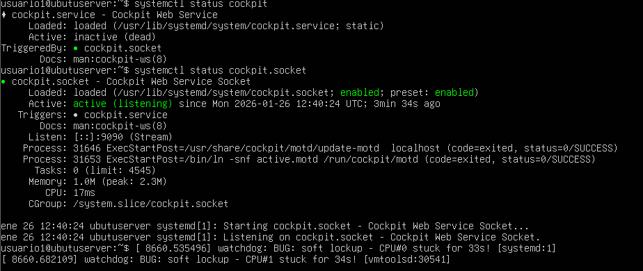
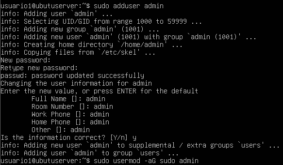
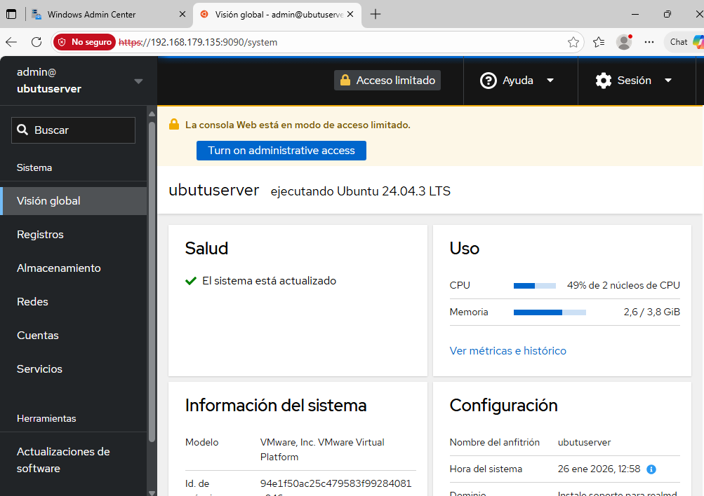
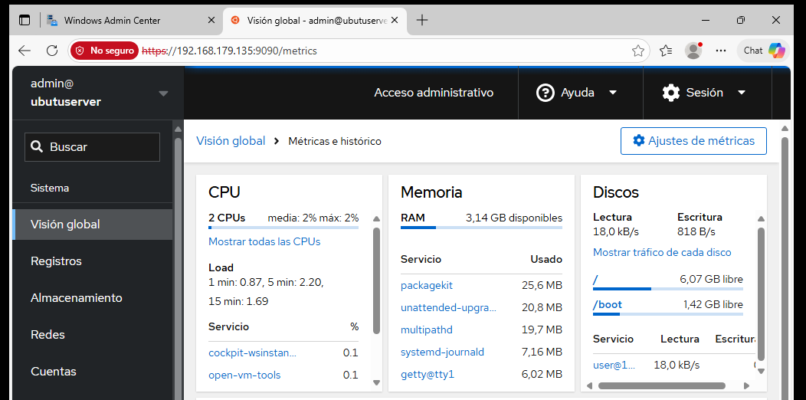

# Administración remota de sistemas en red
## Infraestructura
Para la realización de la tarea la infraestructura constará de una red aislada con cuatro equipos los cuales son un servidor Windows Server 2025, un servidor Ubuntu Server, un Windows 11 desde el que se administrará y monitorizarán los servidores y un pfsense qué se encargará de proporcionarle internet a los equipos de la red.
## PARTE1 – WINDOWS ADMIN CENTER (WAC)
### Introducción
El objetivo es comprobar que es posible administrar y monitorizar de forma remota un Windows Server 2025. Para esto se utilizará un Windows 11 que se encuentre en la misma red para acceder mediante el Windows Admin Center instalado en el al Windows Server 2025 para poderle monitorizar y administrar.   
Dentro del WAC tras haber añadido y accedido al Windows Server he observado la información general del sistema en Información general dónde también se muestra un panel dónde se indica el gasto en CPU y memoria entre otros, aunque los gastos de recursos también se pueden ver en el monitor de rendimiento. Para ver los servicios he ido a la pestaña Servicios y para ver los eventos he ido a la pestaña de Eventos.
### Documentación técnica
| Sistema administrado | Herramienta | Protocolo | Puerto |
| :---: | :----: | :----: | :----: |
| Windows Server 2025 | Windows Admin Center | HTTP | 6600 |
### Acceso a WAC 

### Servidor administrado

#### Monitorización

#### Servicios

#### Eventos 

## PARTE2 – Cockpit (Linux)
### Introducción
El objetivo es comprobar que es posible administrar y monitorizar de forma remota Ubuntu Server 24. Para esto se utilizará un Windows 11 que se encuentra en la misma red que el Ubuntu. Para llevar esto a cabo habrá que instalar en el Windows Server 24 cockpit y crear un usuario que estará en el grupo de root. Posteriormente habrá que acceder al servidor con el usuario creado utilizando el  Windows 11 para administrarle y monitorizarle de forma remota y gráfica.  
Para monitorizar el sistema dentro de Cockpit he accedido a la pestaña visión global donde me indica los parámetros de gasto de la CPU y  la memoria y el estado del servidor. Para obtener una monitorización más detalladas habrá que entrar a Ver métrica e histórico.
### Documentación técnica
| Sistema | Usuario remoto | Herramienta | Protocolo | Puerto |
| :----: | :----: | :----: | :----: | :----: |
| Ubuntu Server | admin | Cockpit | HTTP | 9090 |
### Servicio Cockpit

### Usuario remoto creado

### Acceso web a Cockpit

### Monitorización

