# Acceso remoto a sistemas en red
## Infraestructura
Para la realización de la tarea la infraestructura constará de una red aislada con cuatro equipos los cuales son un servidor Windows Server 2025, un servidor Ubuntu Server, un Windows 11 con el que se accederá de forma remota al Windows Server y al Ubuntu Server  un pfsense qué se encargará de proporcionarle internet a los equipos de la red.
## PARTE1 – Acceso remoto seguro por SSH
### Introducción
El objetivo es comprobar que es posible acceder de forma remota por ssh a un Ubuntu Server utilizando clave publica y privada. Para esto se utilizara la aplicaccion Putty en el Windows 11 que se encuentra en la misma red.   
Para crear la clave publica y la clave privada se utilizará Puttygen y será de tipo RSA con una longitud de 2048 bits. La clave privada se quedará en el windows 11 mientras que la pubica se pasará al Windows Server.
### Documentación técnica
#### Acceso SSH
- Usuario autorizado: remoto_ssh
- Protocolo: ssh
- Cliente: PuTTY
- Autenticación: clave pública
- Contraseña por SSH: deshabilitada
- Usuarios no autorizados: acceso denegado
### Usuario creado
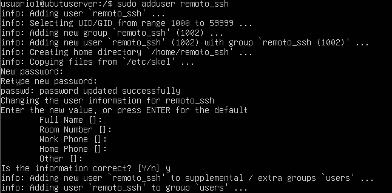
### Servicio SSH activo
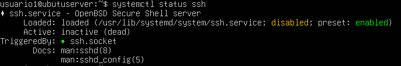
#### Claves generadas
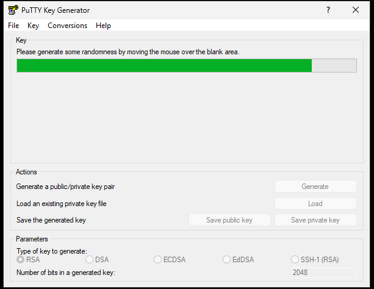
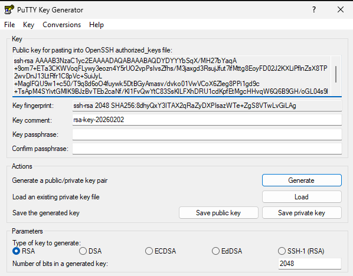
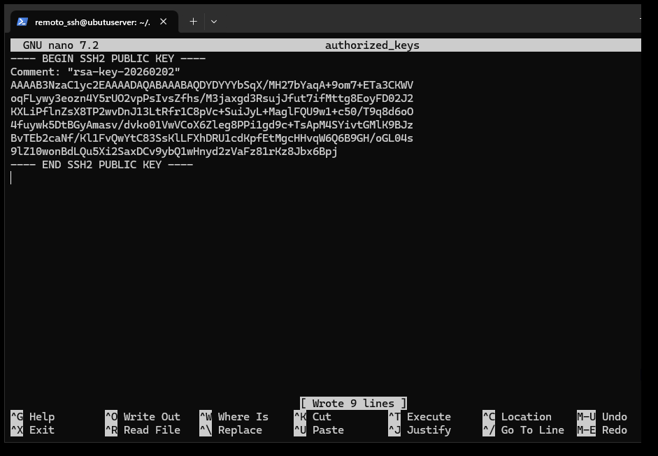
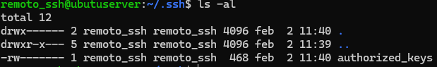
#### Acceso por contraseña deshabilitado
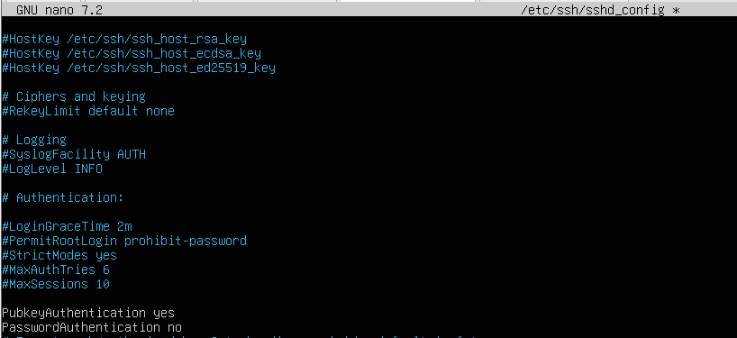
#### Acceso SSH desde PuTTY con remoto_ssh
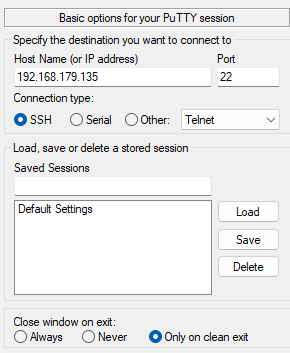
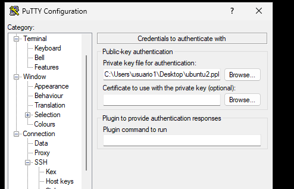
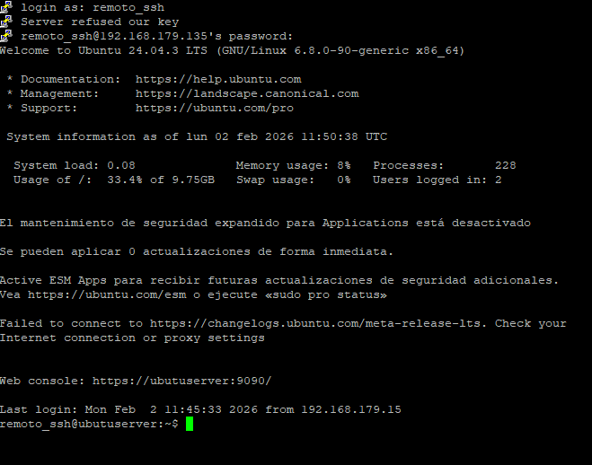
## PARTE2 – Administración remota gráfica (RDP)
### Introducción
El objetivo es comprobar que es posible acceder de forma remota por ssh a un Windows Server 2025 utilizando la herramienta Escritorio remoto (RDP). Para esto se activará el Escritorio remoto en el Windows Server 2025 y desde el Windows 11 que se encuentra en la misma red se utilizara la herramienta  Conexion a escritorio remoto.   
Para crear acceder acceder desde el Windows 11 al Windows Server 25 utilizando Conexion a escritorio remoto habra que proporcionarle la ip del servidor y un usuario autorizado.
### Documentación técnica
#### Acceso RDP
- Usuario RDP: remoto_rdp
- Sistema administrado: Windows Server 2025
- Protocolo: RDP
- Grupo de acceso: Usuarios de Escritorio remoto
- Autenticación a nivel de red: habilitada
- Cifrado: Sí
- Usuarios no autorizados: denegado
### Usuario remoto_rdp creado y añadido al grupo
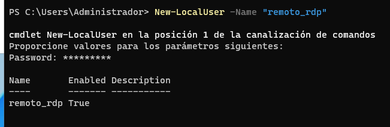
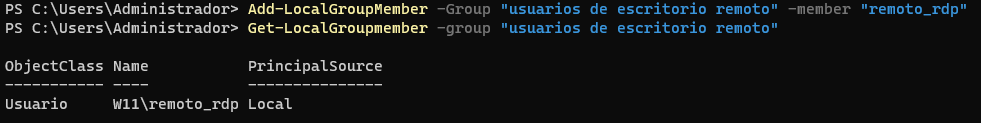
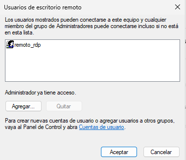
### Autenticación de nivel de red para la conexión habilitada
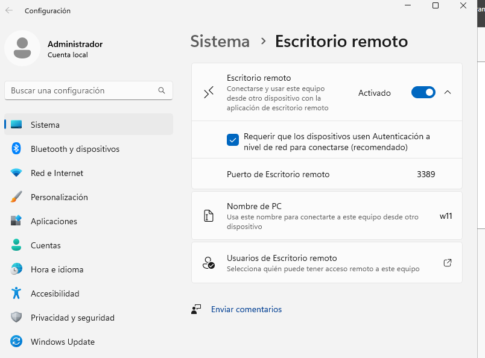
### Sesión RDP activa donde se vea escritorio del servidor y usuario remoto_rdp conectado
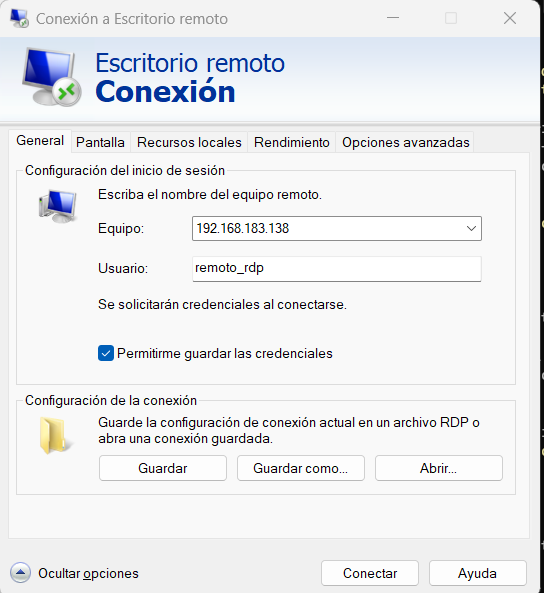
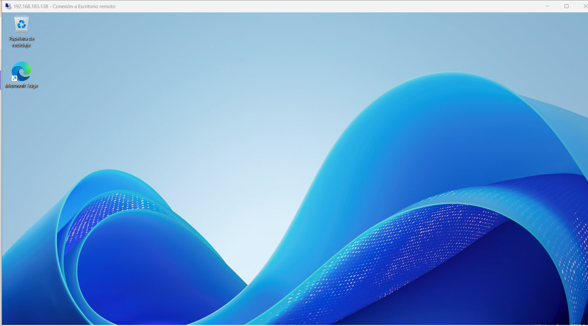
### Acceso denegado a otro usuario
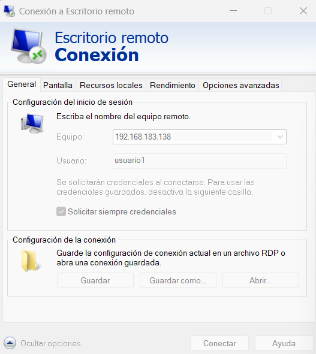
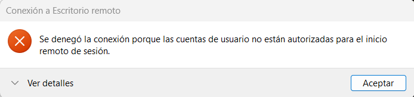
