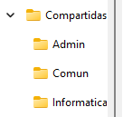
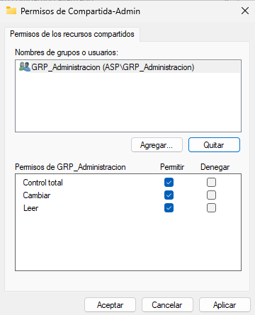
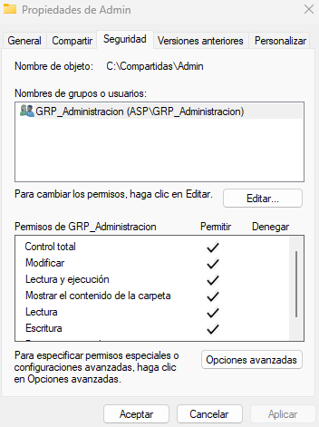
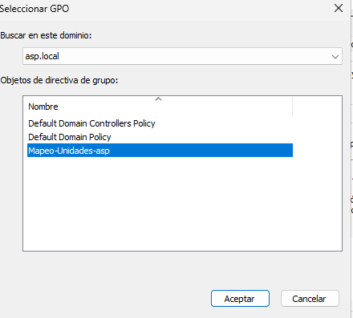
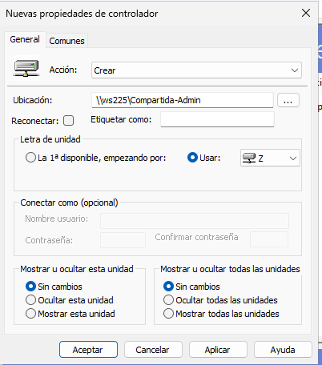
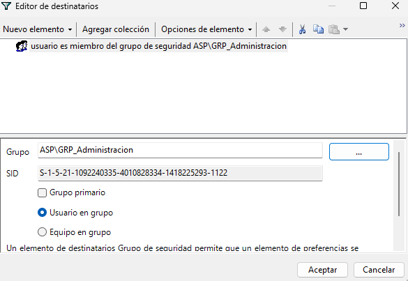
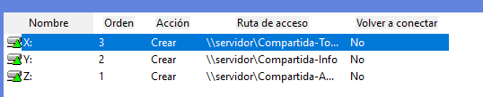

# Automatización de tareas
## Infraestructura
Para la realización de la tarea la infraestructura constará de una red aislada con tres equipos los cuales son un servidor Windows Server 2025, un Windows 11 como cliente del Windows Server y un pfsense qué se encargará de proporcionarle internet a los equipos de la red.
## Tarea1 – Mapeo Automático de Unidades d Red
### Introducción
En este ejercicio se automatizará el acceso a recursos compartidos utilizando políticas de grupo. El objetivo es configurar el mapeo automático de unidades de red para que los usuarios puedan acceder a diferentes carpetas según su departamento.   
Para alcanzar el objetivo se crearán recursos compartidos en el servidor con permisos diferenciados y se diseñará una política de grupo que asigne unidades de red dinámicamente utilizando segmentación a nivel de elemento.
### Documentación 
Para la práctica se han creado tres carpetas compartidas en el servidor: Admin, Informatica y Comun, ubicadas en C:\Compartidas.

Después, se han configurado los permisos para lo cual se ha eliminando el grupo Todos y se ha asignando acceso solo a los usuarios del grupo de seguridad xorrespondiente:
- GRP_Administracion: acceso a la carpeta Admin.
- GRP_Informatica: acceso a la carpeta Informatica.
- Usuarios del dominio: acceso a la carpeta Comun.

Los permisos de compartición y NTFS se han configurado igual para aplicar doble control de acceso y evitar accesos no autorizados mediante rutas directas.

Se ha creado la GPO Mapeo-Unidades-asp, donde se han asignado a las unidades X:(Usuarios del dominio), Y:(GRP_Informatica) y Z: (GRP_Administracion). Se ha utilizado segmentación a nivel de elemento basada en grupos de seguridad para que cada usuario solo pueda ver las unidades correspondientes a su departamento.

La política se ha vinculado a las UO de usuarios y se ha verificado su funcionamiento comprobando la asignación automática de unidades y el acceso denegado entre departamentos.
### Evidencias
### Estructura de carpetas del sevidor

### Permisos de la carpeta compartida Administración

#### GPO de mapeo

#### Configuración de las unidades

#### Segmentación configurada

